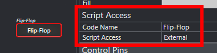
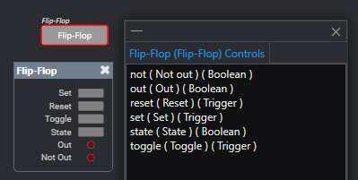

# Q-SYS Remote WebSocket Control for Svelte

**Cybernetically enhanced Q-SYS UIs**

Extend the functionality of the @q-sys/qrwc library with the power of Svelte 5 Runes. This library provides a simple and easy to use interface for lifecycle management and controlling Q-SYS components in a Svelte application.

Note: This library is **not** sponsored, supported or endorsed by QSC, LLC. Q-SYS can not provide support for this library, or any issues that may arise from its use.

## Features

- 🚀 Lightning Fast Setup - Everything you need is built right in.
- 📦 Easy to use - Built for A/V programmers.
- 💎 Svelte 5 Runes - Makes use of the Runes API in svelte 5.
- 📡 Realtime Updates - Automatically updates UI when changes are made in Q-SYS.
- 💥 Redundant Core Support - Automatically switches to backup core if primary falls offline.
- ✨ Full TypeScript Support - Better code completion and error checking.
- ✅ Fully Open Source - No licensing fees, no restrictions.

## Getting Started

### Prerequisites
- Q-SYS Designer 10.0 or later
- Q-SYS Hardware or V-Core (QRWC not supported in emulation mode)
- Q-SYS Components used **MUST** have `Script Access` property set to `All` or `External` in Q-SYS Designer.

### Project Creation
It is **strongly recommended** that you start with a plane Svelte project through Vite. (as opposed to SvelteKit - see the section on [SvelteKit](#sveltekit) below).

Create a new Svelte Project with Vite:
```bash
npm create vite@latest my-qsys-ui -- --template svelte-ts

cd my-qsys-ui
npm install
```
Replace `my-qsys-ui` with the name of your project.

At this point, you may wish to install other UI libraries or tools such as TailwindCSS and DaisyUI.

### Installation

Install the QRWC-Svelte library:
```bash
npm install qrwc-svelte
```

### Usage

#### Instantiating the QRWC-Svelte Instance
It is recommended to create a file in the `lib` directory to provide the QRWC-Svelte instance to all components.

Create a new file in the `lib` directory called `qrwc.ts`:
```typescript
import { QrwcSvelte } from 'qrwc-svelte';

// Create a new instance of QrwcSvelte and connect to a core at 192.168.1.100
export const qrwcSvelte = new QrwcSvelte("192.168.1.100");
```
Replace `192.168.1.100` with the IP address or hostname of your Q-SYS Core.
Additional connection options, including redundant core support is available by passing in a `ConnectionOptions` object instead of a string.

#### Checking Connection Status
You will need to make sure that QrwcSvelte is connected to the core before using any components. QrwcSvelte will automatically attempt to connect to the core when it is created. 

QrwcSvelte provides the property `isConnected` as a `$state<boolean>` rune that can be used to check the connection status.

```svelte
<script lang="ts">
  import { qrwcSvelte } from './lib/qrwc';
</script>

{#if qrwcSvelte.isConnected}
  <h1>Connected</h1>
  <!-- Place Svelte Components here-->
{:else}
  <h1>Not connected</h1>
{/if}
```
**DO NOT** attempt to use any Q-SYS Controls until `qrwcSvelte.isConnected` is `true`. Controls will throw an error if the connection is not established. 

#### Using Q-SYS Controls

There are two steps to use a Q-SYS control.

1. Instantiate the component using useComponent method

```typescript
//connected qrwc svelte instance
import { qrwcSvelte } from "./lib/qrwc";

const myComponent = qrwcSvelte.useComponent('my_component')
```

2. Fetch any controls you desire to use form that component
```typescript
const myButton = myComponent.useButton("myButton")
```

For example, to use a button control with the component name `testControls` and control name `toggleButton`:
create a file named `Button.svelte`:
```svelte
<script lang="ts">
  import { qrwcSvelte } from "./lib/qrwc";

  const testControlsComponent = qrwcSvelte.useComponent("testControls")
  const toggleButton = testControlsComponent.useButton("toggleButton");
</script>

<button
  style="background-color: {toggleButton.state ? 'green' : '#777'};"
  onclick={() => toggleButton.toggle()}>Toggle!
</button>
```
In this example, the button will change color based on the state of the button control in Q-SYS. When clicked, the button will toggle the state of the button control in Q-SYS. Since the state property of the button is a `$state<boolean>` rune, the button will automatically update when the state changes in Q-SYS.

#### Wrapping up

Now that you have created the button component, you can use it in your main App.svelte file:
```svelte
<script lang="ts">
  import { qrwcSvelte } from './lib/qrwc';
  import Button from './Button.svelte';
</script>

{#if qrwcSvelte.isConnected}
  <h1>Connected</h1>
  <Button/>
{:else}
  <h1>Not connected</h1>
{/if}
```

This makes it so that the button is not subscribed to until the connection to the core is established.


## Q-SYS Design Considerations

All components that you wish to control with the QRWC-Svelte library must have the `Script Access` property set to `All` or `External` in Q-SYS Designer.



The `Code Name` property is used as the component name in the QRWC-Svelte library.

This `Code Name` is the value passed into `useComponent`.

Control names are used to reference individual controls inside of a component.
Q-SYS Designer provides a way to view all the control names inside a component. From the `Tools` menu. select `View Component Controls Info...` to show all the control names in a component.



For the example above, the `state` control of the flipflop can be accessed with the `useButton` method of the component's instance.

```svelte
<script lang="ts">
  //Shared QRWC-Svelte instance - see above
  import { qrwcSvelte } from "./lib/qrwc";

  //get the component instance
  const flipFlopComponent = qrwcSvelte.useComponent("Flip-Flop")

//get the button instance 
  const flipFlopState = flipFlopComponent.useButton("state");
</script>

<button style="{toggleButton.state ? 'background-color: green;' : '' }" onclick={() => flipFlopState.toggle()}>Press</button>
```

You can access as many controls as the component contains from a single component instance
```svelte
<script lang="ts">
  import { qrwcSvelte } from "./lib/qrwc";
  const flipFlopComponent = qrwcSvelte.useComponent("Flip-Flop")


  const flipFlopState = flipFlopComponent.useButton("state");
  const flipFlopOutLed = flipFlopComponent.useButton("out");
</script>

```


## Connection Options

By default teh QRWC-Svelte library will attempt to connect to the core at the provided IP address. However, you can provide additional connection options by passing in a `ConnectionOptions` object instead of a string. The example, below lists the defaults for each option.

```typescript
const opts: ConnectionOptions = {
  coreIp: "192.168.1.100",    // IP/hostname of the core
  redundantCoreIp: undefined, // IP/hostname of the redundant core if present
  secure: false,              // true for https/wss, false for http/ws (default)
  poleInterval: 35,           // Polling interval in milliseconds (default 35)
  controlFilter: undefined,   // Filter for control events (default undefined)
};
```

### Core IP and Redundant Core IP
If only a single core is present, the `coreIp` option should be set to the IP address or hostname of the core. If a redundant core is present, the `redundantCoreIp` option should be set to the IP address or hostname of the redundant core. If the `redundantCoreIp` option is set, the library will automatically switch to the redundant core if the primary core goes offline.

### Secure
As of initial release of @q-sys/qrwc, authentication is not supported by the q-sys WebSocket. However, the core serves the QRWC WebSocket with both ws (non-secure) and wss (secure) protocols.

It is the responsibility of the developer to ensure that certificates are trusted by the client for both primary and redundant cores.

As of Q-SYS Designer 10.0, the core is incapable of serving the UI from the core's web server. Therefore, if the core is using a self-signed certificate, the developer must ensure that the certificate is trusted by the client, as the client will not have the opportunity to accept the core's certificate in the browser prior to loading the UI.

### Polling Interval
The `pollInterval` option sets the interval in milliseconds at which the library will poll the core for control updates. The default is 35 milliseconds. The @q-sys/qrwc library uses a [change group (external link)](https://help.qsys.com/#External_Control_APIs/external_controls_change_groups.htm) under the hood. It is generally recommended to leave this at the default unless you have a large number of controls that are changing frequently.

### Control Filter
The `controlFilter` option allows you to filter the controls that are subscribed to by the library. The control filter is an array of strings that represent the control names that the library **will** subscribe to. If the control filter is not provided, the library will subscribe to all controls with external script access in the Q-SYS design.

```typescript
const opts: ConnectionOptions = {
		...
	  controlFilter: ["testControls","myOtherControl"],
};
```
Only the components with the code names `testControls` and `myOtherControl` will be subscribed to by the library. All other controls will be ignored.

> **WARNING**: 
> If none of controls in the design match the control filter, the library will fail to connect to the core. Make sure that the control filter matches at least one control in the design. As long at least one control is matched, the library will connect and ignore any controls that do not match the filter.

Optionally a filter function can be provided to the control filter. The filter function should return a boolean value based on the control. If the function returns `true`, the control will be subscribed to. If the function returns `false`, the control will be ignored.

```typescript
const opts: ConnectionOptions = {
		...
		controlFilter: (ctl) => ctl.Name.match(/^testControl[0-9A-Fa-f]{2}/gm) !== null,
};
```

## SvelteKit

While the QRWC library can be run in either client side or server side runtimes, the QRWC-Svelte library is not compatible with server side rendering. The QRWC-Svelte library expects to be run in the client's browser. 

It is generally easier and faster to use vanilla Svelte without SvelteKit, as the extra features provided by SvelteKit are not usually necessary for an embedded A/V UI (Routing is not helpful on a hardware touch screen). However, if you wish to use SvelteKit, you will need to make sure that the QRWC-Svelte library is only run in client side code.

It is recommended that the QRWC-Svelte instance is created in a global layout script and provided to all child components. In this layout script, pre-rendering and SSR should be disabled as well.

This example +layout.ts file demonstrates how to create the QRWC-Svelte instance in a SvelteKit layout. The core's IP address is provided by an environment variable, and the QRWC-Svelte instance is provided to all child components.

```typescript
//src/routes/+layout.ts

import { QrwcSvelte } from 'qrwc-svelte';
import type { LayoutLoad } from './$types.js';
import { PUBLIC_COREIP } from '$env/static/public';
import { browser } from '$app/environment';

//Disable SSR and pre-rendering
export const ssr = false;
export const prerender = false;

export const load: LayoutLoad = async ({ params }) => {
	if (browser) {
		return {
			qrwc: new QrwcSvelte(PUBLIC_COREIP)
		};
	}
};
```

In order to make sure that Q-SYS controls are not subscribed to before the core is connected, we can use a global +layout.svelte file to check the connection before rendering the child components.

```svelte
<!-- src/routes/+layout.svelte -->
<script lang="ts">
	import '../app.css';
	import type { LayoutData } from './$types.js';
	import type { Snippet } from 'svelte';
	
	let { data, children }: { data: LayoutData, children: Snippet } = $props();

</script>

{#if data.qrwc?.isConnected}
	<p>Connected</p>
	{@render children()}
{:else}
	<p>{data.qrwc?.connectionStatus}</p>
	<p>Connection Attempt: {data.qrwc?.connectionAttemptCount}</p>
{/if}
```

At this point, you can use any Q-SYS controls in page components.

```svelte
<!-- src/routes/+page.svelte -->
<script lang="ts">
	let { data } = $props();
	const testControlsComponent = data.qrwc!.useComponent("testControls");
	const toggleButton = testControlsComponent.useButton("toggleButton");
</script>

<button
  style="background-color: {toggleButton?.state ? 'green' : '#777'};"
  onclick={() => toggleButton?.toggle()}>Toggle!
</button>
```